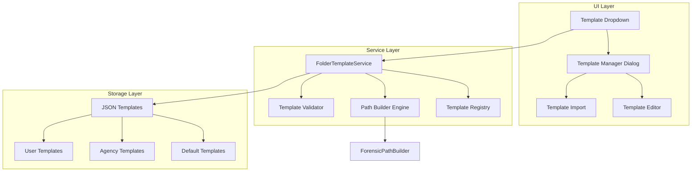

# JSON-Based Folder Structure Template System - Complete Implementation Plan

## Executive Summary

This system will transform your hardcoded folder structure logic into a flexible, template-driven system that supports multiple agencies with different naming conventions and folder hierarchies. Templates are defined in JSON, loaded through the UI, and persisted for easy selection via dropdown.

## 1. System Architecture Overview

### Core Components



## 2. JSON Template Schema Design

### 2.1 Complete Template Structure

```json
{
  "templateId": "agency_toronto_police",
  "templateName": "Toronto Police Service",
  "templateDescription": "Standard folder structure for Toronto Police forensic video recovery",
  "version": "1.0.0",
  "author": "John Smith (Badge: 12345)",
  "created": "2025-01-15T10:00:00Z",
  "lastModified": "2025-01-15T10:00:00Z",
  "agency": {
    "name": "Toronto Police Service",
    "division": "Digital Forensics Unit",
    "contact": "forensics@torontopolice.ca"
  },
  "folderStructure": {
    "levels": [
      {
        "levelId": 1,
        "levelName": "Case Identifier",
        "pattern": "{occurrence_number}_{case_year}",
        "fields": ["occurrence_number"],
        "separator": "_",
        "fallback": "NO_CASE",
        "sanitization": true
      },
      {
        "levelId": 2,
        "levelName": "Location",
        "pattern": "{business_name} @ {location_address}",
        "fields": ["business_name", "location_address"],
        "separator": " @ ",
        "conditional": {
          "both": "{business_name} @ {location_address}",
          "businessOnly": "{business_name}",
          "locationOnly": "{location_address}",
          "neither": "NO_LOCATION"
        },
        "sanitization": true
      },
      {
        "levelId": 3,
        "levelName": "DateTime Range",
        "pattern": "{start_datetime}_to_{end_datetime}_DVR_Time",
        "fields": ["video_start_datetime", "video_end_datetime"],
        "dateFormat": {
          "style": "military",
          "pattern": "DDMMMYY_HHmm",
          "months": ["JAN", "FEB", "MAR", "APR", "MAY", "JUN", "JUL", "AUG", "SEP", "OCT", "NOV", "DEC"],
          "timezone": "local"
        },
        "separator": "_to_",
        "suffix": "_DVR_Time",
        "fallback": "{current_datetime}",
        "sanitization": true
      }
    ],
    "documentsFolder": {
      "placement": "location",  // "occurrence", "location", or "datetime"
      "folderName": "Documents",
      "reportNaming": {
        "timeOffset": "{occurrence_number}_TimeOffset.pdf",
        "technicianLog": "{occurrence_number}_TechnicianLog.pdf",
        "hashCsv": "{occurrence_number}_FileHashes.csv"
      }
    }
  },
  "archiveNaming": {
    "pattern": "{occurrence_number} {business_name} @ {location_address} Video Recovery.zip",
    "fallbackPattern": "{occurrence_number}_Recovery_{current_date}.zip"
  },
  "dateTimeFormats": {
    "military": {
      "displayName": "Military (Law Enforcement)",
      "datePattern": "DDMMMYY",
      "timePattern": "HHmm",
      "separator": "_",
      "example": "30JUL25_2312"
    },
    "iso": {
      "displayName": "ISO 8601",
      "datePattern": "YYYY-MM-DD",
      "timePattern": "HH:mm:ss",
      "separator": "T",
      "example": "2025-07-30T23:12:00"
    },
    "custom": {
      "displayName": "Custom Format",
      "datePattern": "",
      "timePattern": "",
      "separator": "",
      "example": ""
    }
  }
}
```

### 2.2 Template Examples for Different Agencies

#### RCMP Template
```json
{
  "templateId": "agency_rcmp",
  "templateName": "Royal Canadian Mounted Police",
  "folderStructure": {
    "levels": [
      {
        "levelId": 1,
        "pattern": "FILE_{file_number}_{year}",
        "fields": ["file_number"],
        "prefix": "FILE_",
        "suffix": "_{year}"
      },
      {
        "levelId": 2,
        "pattern": "{detachment}_{investigator_badge}",
        "fields": ["detachment", "investigator_badge"]
      },
      {
        "levelId": 3,
        "pattern": "{date_collected}_UTC",
        "dateFormat": {
          "style": "iso",
          "timezone": "UTC"
        }
      }
    ]
  }
}
```

#### FBI Template
```json
{
  "templateId": "agency_fbi",
  "templateName": "Federal Bureau of Investigation",
  "folderStructure": {
    "levels": [
      {
        "levelId": 1,
        "pattern": "CASE-{case_number}-{field_office}",
        "fields": ["case_number", "field_office"]
      },
      {
        "levelId": 2,
        "pattern": "SUBJECT_{subject_name}",
        "fields": ["subject_name"],
        "prefix": "SUBJECT_"
      },
      {
        "levelId": 3,
        "pattern": "{collection_date}_{collection_time}_EST",
        "dateFormat": {
          "style": "us_federal",
          "pattern": "MM-DD-YYYY_HHmm",
          "timezone": "EST"
        }
      }
    ]
  }
}
```

## 3. Template Management System Implementation

### 3.1 Template Service (`core/services/folder_template_service.py`)

```python
from typing import Dict, List, Optional, Any
from pathlib import Path
import json
from dataclasses import dataclass
from datetime import datetime

from .base_service import BaseService
from ..result_types import Result
from ..exceptions import ValidationError

@dataclass
class FolderTemplate:
    """Folder structure template data model"""
    template_id: str
    template_name: str
    template_description: str
    version: str
    folder_structure: Dict[str, Any]
    archive_naming: Dict[str, str]
    created: datetime
    last_modified: datetime
    
    @classmethod
    def from_json(cls, json_data: Dict[str, Any]) -> 'FolderTemplate':
        """Create template from JSON data"""
        return cls(
            template_id=json_data['templateId'],
            template_name=json_data['templateName'],
            template_description=json_data.get('templateDescription', ''),
            version=json_data.get('version', '1.0.0'),
            folder_structure=json_data['folderStructure'],
            archive_naming=json_data.get('archiveNaming', {}),
            created=datetime.fromisoformat(json_data.get('created', datetime.now().isoformat())),
            last_modified=datetime.fromisoformat(json_data.get('lastModified', datetime.now().isoformat()))
        )
    
    def to_json(self) -> Dict[str, Any]:
        """Convert template to JSON-serializable dict"""
        return {
            'templateId': self.template_id,
            'templateName': self.template_name,
            'templateDescription': self.template_description,
            'version': self.version,
            'folderStructure': self.folder_structure,
            'archiveNaming': self.archive_naming,
            'created': self.created.isoformat(),
            'lastModified': self.last_modified.isoformat()
        }

class FolderTemplateService(BaseService):
    """Service for managing folder structure templates"""
    
    def __init__(self, template_dir: Optional[Path] = None):
        super().__init__("FolderTemplateService")
        self.template_dir = template_dir or Path("templates/folder_structures")
        self.template_dir.mkdir(parents=True, exist_ok=True)
        
        self._templates: Dict[str, FolderTemplate] = {}
        self._current_template_id: Optional[str] = None
        self._load_all_templates()
    
    def _load_all_templates(self):
        """Load all templates from disk"""
        # Load default templates
        self._load_default_templates()
        
        # Load user templates
        for template_file in self.template_dir.glob("*.json"):
            try:
                with open(template_file, 'r') as f:
                    json_data = json.load(f)
                    template = FolderTemplate.from_json(json_data)
                    self._templates[template.template_id] = template
                    self.logger.info(f"Loaded template: {template.template_name}")
            except Exception as e:
                self.logger.error(f"Failed to load template {template_file}: {e}")
    
    def _load_default_templates(self):
        """Load built-in default templates"""
        # Your current hardcoded structure as default
        default_template = {
            'templateId': 'default_forensic',
            'templateName': 'Default Forensic',
            'templateDescription': 'Standard forensic folder structure',
            'version': '1.0.0',
            'folderStructure': {
                'levels': [
                    {
                        'levelId': 1,
                        'pattern': '{occurrence_number}',
                        'fields': ['occurrence_number'],
                        'fallback': 'NO_OCCURRENCE'
                    },
                    {
                        'levelId': 2,
                        'pattern': '{business_name} @ {location_address}',
                        'fields': ['business_name', 'location_address'],
                        'conditional': {
                            'both': '{business_name} @ {location_address}',
                            'businessOnly': '{business_name}',
                            'locationOnly': '{location_address}',
                            'neither': 'NO_LOCATION'
                        }
                    },
                    {
                        'levelId': 3,
                        'pattern': '{start_datetime}_to_{end_datetime}_DVR_Time',
                        'dateFormat': {
                            'style': 'military',
                            'pattern': 'DDMMMYY_HHmm'
                        }
                    }
                ],
                'documentsFolder': {
                    'placement': 'location'
                }
            },
            'archiveNaming': {
                'pattern': '{occurrence_number} {business_name} @ {location_address} Video Recovery.zip'
            }
        }
        
        template = FolderTemplate.from_json(default_template)
        self._templates[template.template_id] = template
    
    def get_all_templates(self) -> List[FolderTemplate]:
        """Get all available templates"""
        return list(self._templates.values())
    
    def get_template(self, template_id: str) -> Optional[FolderTemplate]:
        """Get specific template by ID"""
        return self._templates.get(template_id)
    
    def get_current_template(self) -> Optional[FolderTemplate]:
        """Get currently selected template"""
        if self._current_template_id:
            return self._templates.get(self._current_template_id)
        # Return default if none selected
        return self._templates.get('default_forensic')
    
    def set_current_template(self, template_id: str) -> Result[None]:
        """Set the current active template"""
        if template_id not in self._templates:
            return Result.error(ValidationError(
                field_errors={'template_id': f'Template {template_id} not found'}
            ))
        
        self._current_template_id = template_id
        self.logger.info(f"Active template set to: {self._templates[template_id].template_name}")
        return Result.success(None)
    
    def save_template(self, template: FolderTemplate) -> Result[None]:
        """Save template to disk"""
        try:
            template.last_modified = datetime.now()
            template_path = self.template_dir / f"{template.template_id}.json"
            
            with open(template_path, 'w') as f:
                json.dump(template.to_json(), f, indent=2)
            
            self._templates[template.template_id] = template
            self.logger.info(f"Saved template: {template.template_name}")
            return Result.success(None)
            
        except Exception as e:
            self.logger.error(f"Failed to save template: {e}")
            return Result.error(ValidationError(
                field_errors={'save': str(e)}
            ))
    
    def import_template(self, file_path: Path) -> Result[FolderTemplate]:
        """Import template from external file"""
        try:
            with open(file_path, 'r') as f:
                json_data = json.load(f)
            
            # Validate template structure
            if not self._validate_template(json_data):
                return Result.error(ValidationError(
                    field_errors={'structure': 'Invalid template structure'}
                ))
            
            template = FolderTemplate.from_json(json_data)
            
            # Check for duplicate ID
            if template.template_id in self._templates:
                # Generate new ID
                template.template_id = f"{template.template_id}_{int(datetime.now().timestamp())}"
            
            # Save to templates directory
            return self.save_template(template)
            
        except Exception as e:
            return Result.error(ValidationError(
                field_errors={'import': str(e)}
            ))
    
    def _validate_template(self, json_data: Dict[str, Any]) -> bool:
        """Validate template structure"""
        required_fields = ['templateId', 'templateName', 'folderStructure']
        for field in required_fields:
            if field not in json_data:
                return False
        
        # Validate folder structure
        if 'levels' not in json_data['folderStructure']:
            return False
        
        for level in json_data['folderStructure']['levels']:
            if 'levelId' not in level or 'pattern' not in level:
                return False
        
        return True
```

### 3.2 Template-Aware Path Builder (`core/path_template_builder.py`)

```python
from pathlib import Path
from typing import Optional, Dict, Any, List
from datetime import datetime
import re

from .path_utils import PathSanitizer
from .models import FormData

class TemplatePathBuilder:
    """Build paths using folder structure templates"""
    
    def __init__(self, template: Dict[str, Any]):
        self.template = template
        self.sanitizer = PathSanitizer()
    
    def build_path_from_template(self, form_data: FormData) -> Path:
        """Build complete path from template and form data"""
        path_components = []
        
        for level in self.template['folderStructure']['levels']:
            component = self._build_level_component(level, form_data)
            if component:
                path_components.append(component)
        
        return Path(*path_components) if path_components else Path('.')
    
    def _build_level_component(self, level: Dict[str, Any], form_data: FormData) -> str:
        """Build single level component from template"""
        pattern = level.get('pattern', '')
        
        # Handle conditional patterns
        if 'conditional' in level:
            pattern = self._resolve_conditional_pattern(level['conditional'], form_data)
        
        # Handle date formatting
        if 'dateFormat' in level:
            pattern = self._apply_date_formatting(pattern, level['dateFormat'], form_data)
        
        # Replace field placeholders
        component = self._replace_placeholders(pattern, form_data)
        
        # Apply prefix/suffix
        if 'prefix' in level:
            component = level['prefix'] + component
        if 'suffix' in level:
            component = component + level['suffix']
        
        # Handle fallback
        if not component or component == level.get('pattern', ''):
            component = level.get('fallback', 'UNKNOWN')
            component = self._replace_placeholders(component, form_data)
        
        # Sanitize if required
        if level.get('sanitization', True):
            component = self.sanitizer.sanitize_component(component)
        
        return component
    
    def _resolve_conditional_pattern(self, conditional: Dict[str, str], form_data: FormData) -> str:
        """Resolve conditional pattern based on available data"""
        # Example for business/location conditional
        business = getattr(form_data, 'business_name', None)
        location = getattr(form_data, 'location_address', None)
        
        if business and location and 'both' in conditional:
            return conditional['both']
        elif business and 'businessOnly' in conditional:
            return conditional['businessOnly']
        elif location and 'locationOnly' in conditional:
            return conditional['locationOnly']
        else:
            return conditional.get('neither', '')
    
    def _apply_date_formatting(self, pattern: str, date_format: Dict[str, Any], form_data: FormData) -> str:
        """Apply date formatting to pattern"""
        style = date_format.get('style', 'iso')
        
        if style == 'military':
            return self._format_military_date(pattern, date_format, form_data)
        elif style == 'iso':
            return self._format_iso_date(pattern, date_format, form_data)
        else:
            return self._format_custom_date(pattern, date_format, form_data)
    
    def _format_military_date(self, pattern: str, date_format: Dict[str, Any], form_data: FormData) -> str:
        """Format dates in military style"""
        months = date_format.get('months', 
            ['JAN', 'FEB', 'MAR', 'APR', 'MAY', 'JUN', 'JUL', 'AUG', 'SEP', 'OCT', 'NOV', 'DEC'])
        
        # Get date values from form_data
        start_dt = getattr(form_data, 'video_start_datetime', None)
        end_dt = getattr(form_data, 'video_end_datetime', None)
        
        if start_dt:
            # Handle QDateTime objects
            if hasattr(start_dt, 'toString'):
                month_idx = start_dt.date().month() - 1
                start_str = f"{start_dt.date().day()}{months[month_idx]}{start_dt.toString('yy')}_{start_dt.toString('HHmm')}"
            else:
                month_idx = start_dt.month - 1
                start_str = f"{start_dt.day}{months[month_idx]}{start_dt.strftime('%y')}_{start_dt.strftime('%H%M')}"
            
            pattern = pattern.replace('{start_datetime}', start_str)
        
        if end_dt:
            # Similar formatting for end date
            if hasattr(end_dt, 'toString'):
                month_idx = end_dt.date().month() - 1
                end_str = f"{end_dt.date().day()}{months[month_idx]}{end_dt.toString('yy')}_{end_dt.toString('HHmm')}"
            else:
                month_idx = end_dt.month - 1
                end_str = f"{end_dt.day}{months[month_idx]}{end_dt.strftime('%y')}_{end_dt.strftime('%H%M')}"
            
            pattern = pattern.replace('{end_datetime}', end_str)
        
        return pattern
    
    def _replace_placeholders(self, pattern: str, form_data: FormData) -> str:
        """Replace placeholders with actual values from form data"""
        # Find all placeholders
        placeholders = re.findall(r'\{(\w+)\}', pattern)
        
        for placeholder in placeholders:
            # Special placeholders
            if placeholder == 'current_datetime':
                value = datetime.now().strftime('%Y-%m-%d_%H%M%S')
            elif placeholder == 'current_date':
                value = datetime.now().strftime('%Y-%m-%d')
            elif placeholder == 'year':
                value = str(datetime.now().year)
            elif placeholder == 'case_year':
                # Extract year from occurrence number if possible
                occ = getattr(form_data, 'occurrence_number', '')
                year_match = re.search(r'20\d{2}', occ)
                value = year_match.group() if year_match else str(datetime.now().year)
            else:
                # Get from form_data
                value = getattr(form_data, placeholder, None)
                if value is None:
                    value = ''
            
            pattern = pattern.replace(f'{{{placeholder}}}', str(value))
        
        return pattern
    
    def get_documents_path(self, base_path: Path, form_data: FormData) -> Path:
        """Determine documents folder placement based on template"""
        docs_config = self.template['folderStructure'].get('documentsFolder', {})
        placement = docs_config.get('placement', 'location')
        folder_name = docs_config.get('folderName', 'Documents')
        
        # Build the full path
        full_path = self.build_path_from_template(form_data)
        path_parts = full_path.parts
        
        if placement == 'occurrence' and len(path_parts) >= 1:
            # At first level
            return base_path / path_parts[0] / folder_name
        elif placement == 'location' and len(path_parts) >= 2:
            # At second level
            return base_path / path_parts[0] / path_parts[1] / folder_name
        elif placement == 'datetime':
            # At third level (full path)
            return base_path / full_path / folder_name
        else:
            # Default to location level
            if len(path_parts) >= 2:
                return base_path / path_parts[0] / path_parts[1] / folder_name
            else:
                return base_path / path_parts[0] / folder_name
    
    def build_archive_name(self, form_data: FormData) -> str:
        """Build archive name from template"""
        archive_config = self.template.get('archiveNaming', {})
        pattern = archive_config.get('pattern', '{occurrence_number}_Recovery.zip')
        
        # Replace placeholders
        archive_name = self._replace_placeholders(pattern, form_data)
        
        # Clean up any remaining placeholders
        archive_name = re.sub(r'\{[^}]+\}', '', archive_name)
        archive_name = re.sub(r'\s+', ' ', archive_name).strip()
        
        # Ensure .zip extension
        if not archive_name.endswith('.zip'):
            archive_name += '.zip'
        
        # Sanitize
        archive_name = self.sanitizer.sanitize_component(archive_name)
        
        return archive_name
```

## 4. UI Components

### 4.1 Template Selection Dropdown (`ui/components/template_selector.py`)

```python
from PySide6.QtCore import Signal, Qt
from PySide6.QtWidgets import (
    QWidget, QHBoxLayout, QComboBox, QPushButton, 
    QLabel, QToolButton, QMenu
)

from core.services import get_service, FolderTemplateService

class TemplateSelector(QWidget):
    """Template selection dropdown with management options"""
    
    template_changed = Signal(str)  # template_id
    manage_templates = Signal()
    
    def __init__(self, parent=None):
        super().__init__(parent)
        self.template_service = get_service(FolderTemplateService)
        self._setup_ui()
        self._load_templates()
    
    def _setup_ui(self):
        """Create the selector UI"""
        layout = QHBoxLayout(self)
        layout.setContentsMargins(0, 0, 0, 0)
        
        # Label
        layout.addWidget(QLabel("Template:"))
        
        # Template dropdown
        self.template_combo = QComboBox()
        self.template_combo.setMinimumWidth(200)
        self.template_combo.setToolTip("Select folder structure template")
        layout.addWidget(self.template_combo, 1)
        
        # Settings button with menu
        self.settings_btn = QToolButton()
        self.settings_btn.setText("⚙")
        self.settings_btn.setToolTip("Template options")
        
        menu = QMenu(self)
        menu.addAction("Manage Templates", self._on_manage_templates)
        menu.addAction("Import Template", self._on_import_template)
        menu.addAction("Export Current", self._on_export_template)
        menu.addSeparator()
        menu.addAction("Refresh List", self._load_templates)
        
        self.settings_btn.setMenu(menu)
        self.settings_btn.setPopupMode(QToolButton.InstantPopup)
        layout.addWidget(self.settings_btn)
        
        # Connect signals
        self.template_combo.currentIndexChanged.connect(self._on_template_selected)
    
    def _load_templates(self):
        """Load available templates into dropdown"""
        self.template_combo.blockSignals(True)
        self.template_combo.clear()
        
        templates = self.template_service.get_all_templates()
        current_template = self.template_service.get_current_template()
        current_index = 0
        
        for i, template in enumerate(templates):
            self.template_combo.addItem(template.template_name, template.template_id)
            if current_template and template.template_id == current_template.template_id:
                current_index = i
        
        self.template_combo.setCurrentIndex(current_index)
        self.template_combo.blockSignals(False)
    
    def _on_template_selected(self, index):
        """Handle template selection"""
        if index >= 0:
            template_id = self.template_combo.itemData(index)
            result = self.template_service.set_current_template(template_id)
            if result.success:
                self.template_changed.emit(template_id)
    
    def _on_manage_templates(self):
        """Open template manager dialog"""
        self.manage_templates.emit()
    
    def _on_import_template(self):
        """Import template from file"""
        from PySide6.QtWidgets import QFileDialog
        
        file_path, _ = QFileDialog.getOpenFileName(
            self,
            "Import Template",
            "",
            "JSON Files (*.json)"
        )
        
        if file_path:
            from pathlib import Path
            result = self.template_service.import_template(Path(file_path))
            if result.success:
                self._load_templates()
                # Show success message
    
    def _on_export_template(self):
        """Export current template"""
        current = self.template_service.get_current_template()
        if current:
            from PySide6.QtWidgets import QFileDialog
            
            file_path, _ = QFileDialog.getSaveFileName(
                self,
                "Export Template",
                f"{current.template_id}.json",
                "JSON Files (*.json)"
            )
            
            if file_path:
                # Export logic
                pass
```

### 4.2 Template Manager Dialog (`ui/dialogs/template_manager.py`)

```python
from PySide6.QtCore import Qt
from PySide6.QtWidgets import (
    QDialog, QVBoxLayout, QHBoxLayout, QListWidget,
    QPushButton, QGroupBox, QTextEdit, QLabel,
    QListWidgetItem, QSplitter, QDialogButtonBox
)

class TemplateManagerDialog(QDialog):
    """Dialog for managing folder structure templates"""
    
    def __init__(self, parent=None):
        super().__init__(parent)
        self.template_service = get_service(FolderTemplateService)
        self.setWindowTitle("Manage Folder Structure Templates")
        self.resize(800, 600)
        self._setup_ui()
        self._load_templates()
    
    def _setup_ui(self):
        """Create the manager UI"""
        layout = QVBoxLayout(self)
        
        # Main splitter
        splitter = QSplitter(Qt.Horizontal)
        
        # Left: Template list
        list_widget = QWidget()
        list_layout = QVBoxLayout(list_widget)
        
        list_layout.addWidget(QLabel("Available Templates:"))
        
        self.template_list = QListWidget()
        list_layout.addWidget(self.template_list)
        
        # List controls
        list_controls = QHBoxLayout()
        self.add_btn = QPushButton("Add")
        self.duplicate_btn = QPushButton("Duplicate")
        self.delete_btn = QPushButton("Delete")
        
        list_controls.addWidget(self.add_btn)
        list_controls.addWidget(self.duplicate_btn)
        list_controls.addWidget(self.delete_btn)
        list_layout.addLayout(list_controls)
        
        # Right: Template details
        details_widget = QWidget()
        details_layout = QVBoxLayout(details_widget)
        
        details_layout.addWidget(QLabel("Template Details:"))
        
        self.details_text = QTextEdit()
        self.details_text.setReadOnly(True)
        details_layout.addWidget(self.details_text)
        
        # Add preview button
        self.preview_btn = QPushButton("Preview Folder Structure")
        details_layout.addWidget(self.preview_btn)
        
        # Add to splitter
        splitter.addWidget(list_widget)
        splitter.addWidget(details_widget)
        splitter.setStretchFactor(0, 1)
        splitter.setStretchFactor(1, 2)
        
        layout.addWidget(splitter)
        
        # Dialog buttons
        buttons = QDialogButtonBox(
            QDialogButtonBox.Ok | QDialogButtonBox.Cancel
        )
        buttons.accepted.connect(self.accept)
        buttons.rejected.connect(self.reject)
        layout.addWidget(buttons)
        
        # Connect signals
        self.template_list.itemSelectionChanged.connect(self._on_template_selected)
        self.add_btn.clicked.connect(self._on_add_template)
        self.duplicate_btn.clicked.connect(self._on_duplicate_template)
        self.delete_btn.clicked.connect(self._on_delete_template)
        self.preview_btn.clicked.connect(self._on_preview_template)
```

## 5. Service Integration

### 5.1 Update PathService (`core/services/path_service.py`)

```python
class PathService(BaseService, IPathService):
    """Enhanced path service with template support"""
    
    def __init__(self):
        super().__init__("PathService")
        self._path_sanitizer = PathSanitizer()
        self._template_service = None
    
    @property
    def template_service(self):
        """Lazy load template service"""
        if self._template_service is None:
            self._template_service = get_service(FolderTemplateService)
        return self._template_service
    
    def build_forensic_path(self, form_data: FormData, base_path: Path) -> Result[Path]:
        """Build path using current template"""
        try:
            # Get current template
            template = self.template_service.get_current_template()
            if not template:
                # Fallback to legacy builder
                return self._build_legacy_path(form_data, base_path)
            
            # Use template builder
            builder = TemplatePathBuilder(template.to_json())
            relative_path = builder.build_path_from_template(form_data)
            
            # Create full path
            full_path = base_path / relative_path
            full_path.mkdir(parents=True, exist_ok=True)
            
            return Result.success(full_path)
            
        except Exception as e:
            error = FileOperationError(
                f"Failed to build path from template: {e}",
                user_message="Failed to create folder structure."
            )
            return Result.error(error)
```

## 6. Integration with MainWindow

### 6.1 Add Template Selector to UI (`ui/main_window.py`)

```python
def _setup_ui(self):
    """Enhanced UI setup with template selector"""
    # ... existing code ...
    
    # Add template selector to toolbar or form area
    template_bar = QToolBar()
    self.template_selector = TemplateSelector()
    self.template_selector.template_changed.connect(self._on_template_changed)
    self.template_selector.manage_templates.connect(self._open_template_manager)
    template_bar.addWidget(self.template_selector)
    self.addToolBar(template_bar)
    
    # ... rest of UI setup ...

def _on_template_changed(self, template_id: str):
    """Handle template change"""
    self.log(f"Switched to template: {template_id}")
    # Optionally refresh any UI elements that depend on the template

def _open_template_manager(self):
    """Open template manager dialog"""
    dialog = TemplateManagerDialog(self)
    if dialog.exec():
        # Refresh template list if changes were made
        self.template_selector._load_templates()
```

## 7. Converting Agency Requirements to Templates

### 7.1 Template Generator Tool

```python
def generate_template_from_requirements(requirements: str) -> Dict[str, Any]:
    """
    Convert plain text agency requirements to JSON template
    
    Example requirements:
    "We need folders like: CaseID_2025 / Subject Name / Date_Time_UTC"
    """
    
    # This could be enhanced to use Claude API for intelligent parsing
    template = {
        "templateId": f"agency_{datetime.now().timestamp()}",
        "templateName": "Custom Agency Template",
        "folderStructure": {
            "levels": []
        }
    }
    
    # Parse requirements and build template
    # This is where Claude Code could help generate templates
    
    return template
```

## 8. Implementation Phases

### Phase 1: Core Infrastructure (Week 1)
1. Create `FolderTemplateService` class
2. Implement `TemplatePathBuilder` 
3. Create default template from current structure
4. Update `PathService` to use templates

### Phase 2: UI Integration (Week 2)
1. Add `TemplateSelector` widget
2. Integrate into `MainWindow`
3. Test template switching
4. Ensure backward compatibility

### Phase 3: Template Management (Week 3)
1. Create `TemplateManagerDialog`
2. Implement import/export functionality
3. Add template preview feature
4. Create template editor (basic)

### Phase 4: Advanced Features (Week 4)
1. Add more date format options
2. Implement conditional logic
3. Create template validation
4. Add template versioning

## 9. Example Usage Flow

1. **User launches application**
   - Default template loads automatically
   - Template dropdown shows available templates

2. **User selects different agency template**
   - Dropdown selection triggers template change
   - Path building uses new template immediately

3. **User imports new template**
   - Click settings → Import Template
   - Select JSON file from colleague
   - Template added to dropdown

4. **User processes video**
   - Form data entered normally
   - Process button creates folders using selected template
   - Documents placed according to template settings
   - ZIP named according to template pattern

## 10. Benefits & Impact

### Immediate Benefits
- **No code changes** for new folder structures
- **Easy sharing** between agencies
- **Consistent naming** within agencies
- **Reduced training** - familiar structures

### Long-term Benefits
- **Scalability** - Add unlimited templates
- **Maintainability** - Templates are data, not code
- **Flexibility** - Each agency gets their exact structure
- **Documentation** - Templates document the structure

### Performance Impact
- **Minimal** - Template loading is one-time
- **Fast switching** - Templates cached in memory
- **No runtime penalty** - Same path building speed

This system provides the flexibility you need while maintaining the performance and reliability your application is known for. The phased implementation ensures stability while gradually adding powerful new capabilities.