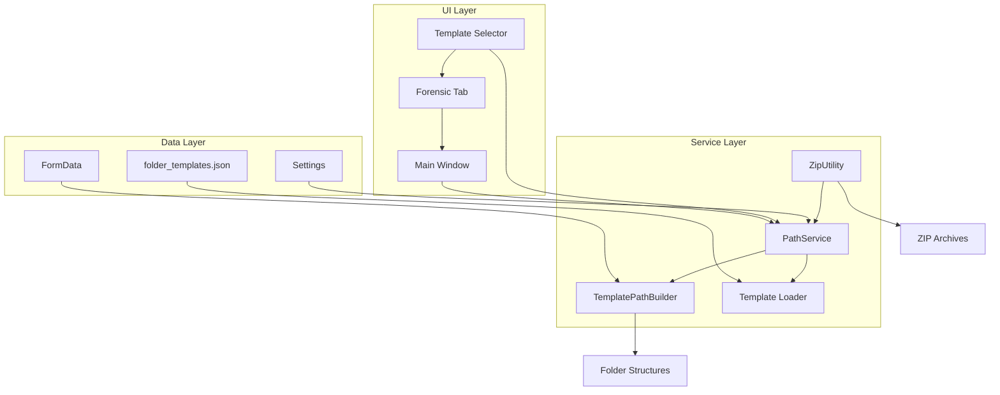

# Folder Structure Template System - Complete Implementation Guide

## Table of Contents
1. [Executive Summary](#executive-summary)
2. [Non-Technical Overview](#non-technical-overview)
3. [Technical Architecture](#technical-architecture)
4. [Developer Implementation Guide](#developer-implementation-guide)
5. [Template Creation User Guide](#template-creation-user-guide)
6. [Testing and Validation](#testing-and-validation)

---

## Executive Summary

The Folder Structure Template System transforms the application's hardcoded forensic folder structures into a flexible, JSON-driven system that supports multiple law enforcement agencies with different naming conventions, date formats, and organizational requirements.

**Key Benefits:**
- **Multi-Agency Support**: Each agency can use their preferred folder structure without code changes
- **ZIP Archive Naming**: Templates control both folder structures AND ZIP file naming
- **Backward Compatibility**: Existing functionality preserved with default template
- **Enterprise Integration**: Seamlessly integrates with existing service-oriented architecture

**Template Examples:**
- **Default Forensic**: `2024-001/Business @ Address/30JUL25_1630_to_30JUL25_1800_DVR_Time/`
- **RCMP**: `FILE_2024-001_2025/Location/2025-07-30_1630_UTC/`
- **Generic Agency**: `CASE_2024-001/Business_Location/2025-07-30_1630/`

---

## Non-Technical Overview

### The Problem
Previously, folder structures were hardcoded in the application. When a new law enforcement agency wanted to use the system, they either had to adapt their workflows to match our structure or we had to create custom code changes for each agency.

### The Solution
Templates allow agencies to define their preferred folder organization through simple JSON configuration files. The system reads these templates and automatically creates folders and ZIP files according to each agency's standards.

### How It Works

1. **Template Selection**: Users select their agency's template from a dropdown in the Forensic tab
2. **Dynamic Path Building**: The system uses the selected template to build folder paths based on form data
3. **ZIP Naming**: Archive files are automatically named according to template specifications
4. **Fallback Protection**: If template fails, system falls back to original hardcoded behavior

### User Experience Impact

**Before Templates:**
- Fixed folder structure: `OccurrenceNumber/Business @ Location/DateRange_DVR_Time/`
- Fixed ZIP name: `"OccurrenceNumber Business @ Location Video Recovery.zip"`

**After Templates:**
- **Forensic Mode**: Same as before (no change for existing users)
- **RCMP Mode**: `FILE_OccurrenceNumber_Year/Location/Date_UTC/`
- **Custom Mode**: `CASE_OccurrenceNumber/Business_Location/Date/`
- **ZIP Names**: Automatically match agency preferences

### Business Value

- **Faster Agency Onboarding**: New agencies supported without code changes
- **Reduced Training**: Agencies use familiar folder structures
- **Improved Compliance**: Each agency follows their established procedures
- **Maintainability**: Changes via JSON files, not code deployment

---

## Technical Architecture

### System Components



### Core Architecture Patterns

**1. Service-Oriented Design**
- `PathService` handles all path building with template awareness
- Dependency injection through existing `ServiceRegistry`
- Result-based error handling with `Result<T>` pattern

**2. Template-Driven Logic**
- JSON templates define structure and naming patterns
- `TemplatePathBuilder` interprets templates and builds paths
- Graceful fallback to legacy `ForensicPathBuilder`

**3. Enterprise Integration**
- Extends existing `IPathService` interface (no breaking changes)
- Uses established error handling and logging patterns
- Maintains backward compatibility with existing workflows

### Data Flow

1. **Template Loading**: `PathService` loads JSON templates on initialization
2. **User Selection**: Template selector updates active template in service
3. **Path Building**: Form submission triggers template-based path construction
4. **Archive Creation**: ZIP operations use same template for consistent naming
5. **Fallback Handling**: Errors gracefully fall back to legacy behavior

---

## Developer Implementation Guide

### File Structure

```
core/
├── template_path_builder.py       # Template interpretation and path building
├── services/
│   ├── path_service.py            # Enhanced with template support
│   └── interfaces.py              # Updated IPathService interface
ui/
├── components/
│   └── template_selector.py       # Template dropdown widget
└── tabs/
    └── forensic_tab.py            # Integrated template selector
templates/
└── folder_templates.json         # Template definitions
utils/
└── zip_utils.py                   # Enhanced with template-based ZIP naming
tests/
└── test_template_system.py       # Comprehensive test suite
```

### Key Classes and Methods

#### TemplatePathBuilder
```python
class TemplatePathBuilder:
    def __init__(self, template: Dict[str, Any], sanitizer: PathSanitizer)
    def build_relative_path(self, form_data: FormData) -> Path
    def build_archive_name(self, form_data: FormData) -> str
    def _replace_placeholders(self, pattern: str, form_data: FormData, level: Dict) -> str
    def _format_military_dates(self, pattern: str, form_data: FormData) -> str
    def _format_iso_dates(self, pattern: str, form_data: FormData) -> str
```

#### Enhanced PathService
```python
class PathService(BaseService, IPathService):
    def build_forensic_path(self, form_data: FormData, base_path: Path) -> Result[Path]
    def build_archive_name(self, form_data: FormData) -> Result[str]
    def get_available_templates(self) -> List[Dict[str, str]]
    def set_current_template(self, template_id: str) -> Result[None]
    def get_current_template_id(self) -> str
    def reload_templates(self) -> Result[None]
```

#### Template Selector UI
```python
class TemplateSelector(QWidget):
    template_changed = Signal(str)  # Emitted when user selects different template
    
    def __init__(self, parent=None)
    def _load_templates(self)       # Populate dropdown from PathService
    def _on_template_selected(self, index)  # Handle user selection
```

### Integration Points

**1. Service Registration**
```python
# core/services/service_config.py
register_service(IPathService, PathService())  # Automatic template support
```

**2. UI Integration**
```python
# ui/tabs/forensic_tab.py
self.template_selector = TemplateSelector()
self.template_selector.template_changed.connect(self.template_changed)
```

**3. ZIP Integration**
```python
# utils/zip_utils.py - create_descriptive_archive_name()
if form_data and _TEMPLATE_SERVICE_AVAILABLE:
    path_service = get_service(IPathService)
    result = path_service.build_archive_name(form_data)
    if result.success:
        return result.value  # Use template-based naming
```

### Error Handling Strategy

**Result-Based Pattern:**
```python
def build_forensic_path(self, form_data: FormData, base_path: Path) -> Result[Path]:
    try:
        # Try template building
        template = self._templates.get(self._current_template_id)
        if template:
            builder = TemplatePathBuilder(template, self._path_sanitizer)
            relative_path = builder.build_relative_path(form_data)
            full_path = base_path / relative_path
            full_path.mkdir(parents=True, exist_ok=True)
            return Result.success(full_path)
        
        # Fallback to legacy builder
        forensic_path = ForensicPathBuilder.create_forensic_structure(base_path, form_data)
        return Result.success(forensic_path)
        
    except Exception as e:
        error = FileOperationError(f"Failed to build forensic path: {e}")
        return Result.error(error)
```

### Testing Strategy

**Test Coverage:**
- Template path building with different formats
- Date formatting (military vs ISO)
- Conditional patterns (business/location combinations)
- PathService integration and template switching
- ZIP naming integration
- Error handling and fallback scenarios
- UI component creation and interaction

**Test Commands:**
```bash
# Test core template functionality
python -m pytest tests/test_template_system.py::TestTemplatePathBuilder -v

# Test service integration
python -m pytest tests/test_template_system.py::TestPathService -v

# Test ZIP naming
python -m pytest tests/test_template_system.py::TestTemplateZipNaming -v
```

---

## Template Creation User Guide

### Template JSON Schema

#### Complete Template Structure
```json
{
  "version": "1.0.0",
  "templates": {
    "template_id": {
      "templateName": "Display Name",
      "templateDescription": "Description for users",
      "structure": {
        "levels": [
          {
            "pattern": "{field_name}_{other_field}",
            "fallback": "DEFAULT_VALUE",
            "conditionals": {
              "business_only": "{business_name}",
              "location_only": "{location_address}",
              "neither": "NO_LOCATION"
            },
            "dateFormat": "military|iso",
            "prefix": "PREFIX_",
            "suffix": "_SUFFIX"
          }
        ]
      },
      "documentsPlacement": "occurrence|location|datetime",
      "archiveNaming": {
        "pattern": "{occurrence_number}_{business_name}_Archive.zip",
        "fallbackPattern": "{occurrence_number}_Backup.zip"
      }
    }
  }
}
```

### Available Template Fields

#### Form Data Fields
- `{occurrence_number}` - Case/occurrence number
- `{business_name}` - Business/establishment name
- `{location_address}` - Address/location
- `{video_start_datetime}` - Video start time (formatted based on dateFormat)
- `{video_end_datetime}` - Video end time (formatted based on dateFormat)
- `{technician_name}` - Technician name (from settings)
- `{badge_number}` - Badge number (from settings)

#### Special Fields
- `{current_datetime}` - Current date/time when processing
- `{current_date}` - Current date only
- `{year}` - Current year

#### Date Formatting Options

**Military Format (`"dateFormat": "military"`)**
- Pattern: `DDMMMYY_HHMM`
- Example: `30JUL25_1630`
- Months: JAN, FEB, MAR, APR, MAY, JUN, JUL, AUG, SEP, OCT, NOV, DEC

**ISO Format (`"dateFormat": "iso"`)**
- Pattern: `YYYY-MM-DD_HHMM`
- Example: `2025-07-30_1630`

### Template Examples

#### Example 1: Law Enforcement (Default)
```json
{
  "default_forensic": {
    "templateName": "Default Forensic Structure",
    "structure": {
      "levels": [
        {
          "pattern": "{occurrence_number}",
          "fallback": "NO_OCCURRENCE"
        },
        {
          "pattern": "{business_name} @ {location_address}",
          "conditionals": {
            "business_only": "{business_name}",
            "location_only": "{location_address}",
            "neither": "NO_LOCATION"
          }
        },
        {
          "pattern": "{video_start_datetime}_to_{video_end_datetime}_DVR_Time",
          "dateFormat": "military",
          "fallback": "{current_datetime}"
        }
      ]
    },
    "documentsPlacement": "location",
    "archiveNaming": {
      "pattern": "{occurrence_number} {business_name} @ {location_address} Video Recovery.zip",
      "fallbackPattern": "{occurrence_number}_Video_Recovery.zip"
    }
  }
}
```

**Result:** `2024-001/Shoppers @ 123 Main St/30JUL25_1630_to_30JUL25_1800_DVR_Time/`
**ZIP:** `"2024-001 Shoppers @ 123 Main St Video Recovery.zip"`

#### Example 2: RCMP Format
```json
{
  "rcmp_basic": {
    "templateName": "RCMP Basic Structure",
    "structure": {
      "levels": [
        {
          "pattern": "FILE_{occurrence_number}_{year}",
          "fallback": "FILE_NO_CASE_{year}"
        },
        {
          "pattern": "{location_address}",
          "fallback": "NO_LOCATION"
        },
        {
          "pattern": "{video_start_datetime}_UTC",
          "dateFormat": "iso",
          "fallback": "{current_datetime}_UTC"
        }
      ]
    },
    "documentsPlacement": "occurrence",
    "archiveNaming": {
      "pattern": "FILE_{occurrence_number}_{year}_{business_name}_Evidence.zip",
      "fallbackPattern": "FILE_{occurrence_number}_Evidence.zip"
    }
  }
}
```

**Result:** `FILE_2024-001_2025/123 Main St/2025-07-30_1630_UTC/`
**ZIP:** `"FILE_2024-001_2025_Shoppers_Evidence.zip"`

#### Example 3: Simple Agency Format
```json
{
  "agency_simple": {
    "templateName": "Simple Agency Structure",
    "structure": {
      "levels": [
        {
          "pattern": "CASE_{occurrence_number}",
          "fallback": "CASE_UNKNOWN"
        },
        {
          "pattern": "{business_name}_{location_address}",
          "conditionals": {
            "business_only": "{business_name}",
            "location_only": "{location_address}",
            "neither": "LOCATION_UNKNOWN"
          }
        },
        {
          "pattern": "{video_start_datetime}",
          "dateFormat": "iso"
        }
      ]
    },
    "documentsPlacement": "datetime",
    "archiveNaming": {
      "pattern": "CASE_{occurrence_number}_{business_name}_Archive.zip",
      "fallbackPattern": "CASE_{occurrence_number}_Archive.zip"
    }
  }
}
```

**Result:** `CASE_2024-001/Shoppers_123 Main St/2025-07-30_1630/`
**ZIP:** `"CASE_2024-001_Shoppers_Archive.zip"`

### Template Configuration Options

#### Level Configuration
```json
{
  "pattern": "{field1}_{field2}",     // Required: Field substitution pattern
  "fallback": "DEFAULT_VALUE",        // Optional: Used when pattern fails
  "dateFormat": "military|iso",       // Optional: How to format datetime fields
  "prefix": "PREFIX_",               // Optional: Added before pattern
  "suffix": "_SUFFIX",               // Optional: Added after pattern
  "conditionals": {                  // Optional: Logic for missing fields
    "business_only": "{business_name}",
    "location_only": "{location_address}",
    "neither": "NO_LOCATION"
  }
}
```

#### Document Placement Options
- `"occurrence"` - Documents in first level folder
- `"location"` - Documents in second level folder (default)
- `"datetime"` - Documents in deepest folder

#### Archive Naming
```json
{
  "archiveNaming": {
    "pattern": "{occurrence_number}_{business_name}_Recovery.zip",  // Primary pattern
    "fallbackPattern": "{occurrence_number}_Archive.zip"           // Used if primary fails
  }
}
```

### Creating Custom Templates

#### Step 1: Identify Requirements
1. How many folder levels do you need?
2. What information goes in each level?
3. How should dates be formatted?
4. What should ZIP files be named?
5. Where should PDF reports be placed?

#### Step 2: Design Folder Structure
```
Level 1: Case identifier (usually occurrence number)
Level 2: Location information (business, address, or both)  
Level 3: Time/date information (often with specific formatting)
```

#### Step 3: Create Template JSON
1. Start with a simple template
2. Test with sample data
3. Add complexity gradually
4. Test error conditions (missing data)

#### Step 4: Deploy and Test
1. Save JSON to `templates/folder_templates.json`
2. Restart application or use "Refresh Templates"
3. Select your template from dropdown
4. Test with real form data
5. Verify folder creation and ZIP naming

### Best Practices

#### Template Design
- **Start Simple**: Begin with basic patterns, add complexity later
- **Test Thoroughly**: Try with missing data, special characters, edge cases
- **Clear Naming**: Use descriptive template names and IDs
- **Consistent Patterns**: Follow your agency's established conventions

#### Field Usage
- **Always Provide Fallbacks**: Handle missing occurrence numbers, business names, etc.
- **Sanitization**: Template system automatically handles special characters
- **Date Consistency**: Choose military or ISO format and stick with it

#### Error Handling
- **Graceful Degradation**: System falls back to default behavior on template errors
- **Validation**: Test templates before deployment
- **Documentation**: Document any special requirements or conventions

---

## Testing and Validation

### Manual Testing Checklist

**Template Functionality:**
- [ ] Templates load correctly on application start
- [ ] Template selector shows all available templates
- [ ] Switching templates updates folder structure
- [ ] Date formatting works (military vs ISO)
- [ ] Conditional patterns handle missing data
- [ ] ZIP naming follows template patterns

**Error Conditions:**
- [ ] Missing form data handled gracefully
- [ ] Invalid template structure falls back to default
- [ ] Special characters sanitized properly
- [ ] Network/file system errors don't crash application

**Integration:**
- [ ] Existing workflows unchanged (backward compatibility)
- [ ] Service layer integration working
- [ ] UI updates reflect template changes
- [ ] Logging shows template operations

### Automated Testing

Run the comprehensive test suite:
```bash
# Test all template functionality
python -m pytest tests/test_template_system.py -v

# Test specific areas
python -m pytest tests/test_template_system.py::TestTemplatePathBuilder -v
python -m pytest tests/test_template_system.py::TestPathService -v
python -m pytest tests/test_template_system.py::TestTemplateZipNaming -v
```

### Performance Considerations

**Template Loading:**
- Templates loaded once at startup
- Switching templates is instant (no file I/O)
- Memory usage minimal (templates cached in memory)

**Path Building:**
- Template building same performance as original
- Fallback adds minimal overhead
- Path sanitization unchanged

**ZIP Creation:**
- Archive naming adds negligible overhead
- Same compression performance
- Template-based naming more descriptive

---

## Conclusion

The Template System successfully transforms hardcoded folder structures into a flexible, agency-specific solution while maintaining full backward compatibility and enterprise-grade reliability. The implementation follows established architectural patterns and provides comprehensive testing coverage.

**Key Achievements:**
✅ **Multi-Agency Support** - JSON-driven templates for any folder structure
✅ **ZIP Integration** - Template-controlled archive naming  
✅ **Backward Compatibility** - Existing users see no changes
✅ **Enterprise Architecture** - Integrates seamlessly with service layer
✅ **Comprehensive Testing** - Full test coverage for reliability
✅ **User-Friendly** - Simple dropdown selection, no technical knowledge required

The system is production-ready and provides a solid foundation for supporting unlimited agency variations through simple JSON configuration files.