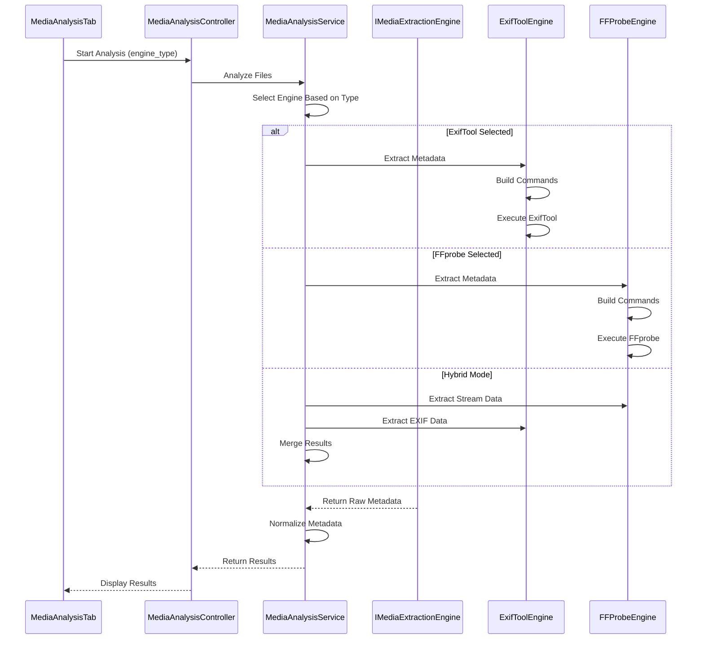

# ExifTool Integration Implementation Plan

## Executive Summary

This document outlines a comprehensive plan to integrate ExifTool alongside FFprobe in the Folder Structure Application's Media Analysis feature. ExifTool will provide enhanced metadata extraction capabilities, particularly for mobile device photos and videos, extracting critical forensic information that FFprobe cannot access. The implementation follows a modular architecture pattern, maintaining complete separation between FFprobe and ExifTool implementations while allowing seamless switching through the UI.

## Table of Contents

1. [Rationale and Benefits](#rationale-and-benefits)
2. [Architecture Overview](#architecture-overview)
3. [Component Design](#component-design)
4. [Implementation Phases](#implementation-phases)
5. [Technical Specifications](#technical-specifications)
6. [UI/UX Considerations](#ui-ux-considerations)
7. [Testing Strategy](#testing-strategy)
8. [Performance Considerations](#performance-considerations)
9. [Risk Mitigation](#risk-mitigation)
10. [Timeline and Milestones](#timeline-and-milestones)

---

## Rationale and Benefits

### Why ExifTool?

ExifTool provides critical metadata that FFprobe cannot extract, particularly important for forensic analysis:

#### Unique ExifTool Capabilities
- **Device Identification**: Serial numbers, manufacturer-specific tags, device signatures
- **GPS Data**: Precise location with accuracy radius, altitude, direction, speed
- **Camera Settings**: ISO, exposure, focal length, lens information, flash status
- **Timestamps**: Sub-second precision, timezone information, multiple date fields
- **Proprietary Tags**: Apple Live Photos, Android-specific metadata, MakerNotes
- **Face Recognition**: Tagged regions and faces (when present)
- **Document Metadata**: Author, software, modification history
- **Embedded Thumbnails**: Multiple preview images often containing original metadata

#### Forensic Value
- **Device Attribution**: Link files to specific devices through serial numbers
- **Timeline Reconstruction**: Multiple timestamp fields help verify authenticity
- **Location Intelligence**: GPS data provides geographical context
- **Tamper Detection**: Metadata inconsistencies reveal manipulation
- **Chain of Custody**: Software and modification tags track file history

### Comparison with FFprobe

| Aspect | FFprobe | ExifTool |
|--------|---------|----------|
| **Focus** | Stream/codec analysis | Comprehensive metadata |
| **Metadata Depth** | Basic container info | Deep EXIF, XMP, IPTC extraction |
| **Device Info** | None | Make, model, serial number |
| **GPS Data** | Limited | Complete with accuracy |
| **Performance** | Fast (20ms/file) | Moderate (50-100ms/file) |
| **File Types** | Video/audio focused | 1000+ formats including images |

---

## Architecture Overview

### Design Principles

1. **Modularity**: Complete separation between FFprobe and ExifTool implementations
2. **Interface Consistency**: Both tools implement common extraction interface
3. **User Choice**: Runtime selection of extraction engine
4. **Graceful Degradation**: System functions if either tool is unavailable
5. **Performance Optimization**: Lazy loading and caching strategies
6. **Extensibility**: Easy to add more extraction engines in the future

### High-Level Architecture

```
MediaAnalysisTab (UI)
        │
        ├── Extraction Engine Selector
        │   ├── FFprobe (default)
        │   ├── ExifTool
        │   └── Hybrid (both)
        │
MediaAnalysisController
        │
        ├── IMediaExtractionEngine (Interface)
        │   ├── FFProbeExtractionEngine
        │   │   ├── FFProbeBinaryManager
        │   │   ├── FFProbeWrapper
        │   │   └── FFProbeCommandBuilder
        │   │
        │   └── ExifToolExtractionEngine
        │       ├── ExifToolBinaryManager
        │       ├── ExifToolWrapper
        │       └── ExifToolCommandBuilder
        │
MediaAnalysisService
        │
        └── MetadataNormalizer (Extended for ExifTool fields)
```

### Module Interaction Flow



---

## Component Design

### 1. Core Interfaces

#### IMediaExtractionEngine Interface

```python
from abc import ABC, abstractmethod
from pathlib import Path
from typing import Dict, Any, List, Optional
from core.result_types import Result

class IMediaExtractionEngine(ABC):
    """Common interface for all metadata extraction engines"""
    
    @abstractmethod
    def is_available(self) -> bool:
        """Check if extraction engine is available"""
        pass
    
    @abstractmethod
    def get_engine_info(self) -> Dict[str, Any]:
        """Get engine name, version, and capabilities"""
        pass
    
    @abstractmethod
    def extract_metadata(
        self, 
        file_path: Path,
        settings: 'MediaAnalysisSettings',
        timeout: float = 5.0
    ) -> Result[Dict[str, Any]]:
        """Extract metadata from single file"""
        pass
    
    @abstractmethod
    def extract_batch(
        self,
        file_paths: List[Path],
        settings: 'MediaAnalysisSettings',
        max_workers: int = 8,
        progress_callback: Optional[callable] = None
    ) -> Result[List[Dict[str, Any]]]:
        """Extract metadata from multiple files"""
        pass
    
    @abstractmethod
    def get_supported_fields(self) -> Dict[str, List[str]]:
        """Return supported metadata fields by category"""
        pass
```

### 2. ExifTool Components

#### ExifToolBinaryManager

```python
class ExifToolBinaryManager:
    """Manages ExifTool binary detection and validation"""
    
    def __init__(self):
        self.binary_path: Optional[Path] = None
        self.version_info: Optional[str] = None
        self.is_validated: bool = False
        self.stay_open_supported: bool = False
        
    def locate_binary(self) -> Optional[Path]:
        """Find ExifTool in bundled locations or system PATH"""
        # Check: bin/exiftool.exe, system PATH, common locations
        
    def validate_binary(self) -> bool:
        """Validate ExifTool functionality and version"""
        # Run: exiftool -ver
        # Check stay_open support for batch mode
        
    def get_status_info(self) -> Dict[str, Any]:
        """Return availability and capabilities"""
```

#### ExifToolCommandBuilder

```python
class ExifToolCommandBuilder:
    """Build optimized ExifTool commands based on settings"""
    
    # Comprehensive field mappings
    FIELD_MAPPINGS = {
        # Device Information
        'device_make': ['-Make'],
        'device_model': ['-Model'],
        'serial_number': ['-SerialNumber', '-InternalSerialNumber'],
        'lens_info': ['-LensInfo', '-LensModel', '-LensSerialNumber'],
        
        # GPS Information
        'gps_latitude': ['-GPSLatitude'],
        'gps_longitude': ['-GPSLongitude'],
        'gps_altitude': ['-GPSAltitude'],
        'gps_accuracy': ['-GPSHPositioningError'],
        'gps_speed': ['-GPSSpeed'],
        'gps_direction': ['-GPSImgDirection', '-GPSTrack'],
        
        # Camera Settings
        'iso': ['-ISO'],
        'exposure_time': ['-ExposureTime', '-ShutterSpeed'],
        'aperture': ['-FNumber', '-ApertureValue'],
        'focal_length': ['-FocalLength', '-FocalLengthIn35mmFormat'],
        'flash': ['-Flash'],
        'white_balance': ['-WhiteBalance'],
        
        # Timestamps
        'date_time_original': ['-DateTimeOriginal'],
        'create_date': ['-CreateDate'],
        'modify_date': ['-ModifyDate'],
        'sub_sec_time': ['-SubSecTimeOriginal', '-SubSecTime'],
        'timezone': ['-TimeZone', '-OffsetTimeOriginal'],
        
        # Advanced Mobile Tags
        'orientation': ['-Orientation'],
        'scene_type': ['-SceneCaptureType', '-SceneType'],
        'subject_area': ['-SubjectArea'],
        'face_regions': ['-RegionInfo'],
        'live_photo': ['-MediaGroupUUID'],  # Apple Live Photo
        
        # File Information
        'file_type': ['-FileType'],
        'mime_type': ['-MIMEType'],
        'file_size': ['-FileSize'],
        'image_size': ['-ImageSize'],
        
        # Proprietary/MakerNotes
        'maker_notes': ['-MakerNotes:all'],
        'android_info': ['-XMP:all'],
        'apple_info': ['-Apple:all']
    }
    
    def build_command(
        self,
        binary_path: Path,
        file_path: Path,
        settings: 'MediaAnalysisSettings'
    ) -> List[str]:
        """Build optimized command for single file"""
        cmd = [str(binary_path)]
        
        # Output format
        cmd.extend(['-json', '-struct'])
        
        # Add requested fields only
        for field in self._get_enabled_fields(settings):
            if field in self.FIELD_MAPPINGS:
                cmd.extend(self.FIELD_MAPPINGS[field])
        
        # Performance options
        cmd.extend(['-fast2'])  # Skip trailer for speed
        
        # Add file path
        cmd.append(str(file_path))
        
        return cmd
    
    def build_batch_command(
        self,
        binary_path: Path,
        settings: 'MediaAnalysisSettings'
    ) -> List[str]:
        """Build command for stay_open batch mode"""
        return [
            str(binary_path),
            '-stay_open', 'True',
            '-@', '-'  # Read commands from stdin
        ]
```

#### ExifToolWrapper

```python
class ExifToolWrapper:
    """Wrapper for ExifTool subprocess management"""
    
    def __init__(self, binary_manager: ExifToolBinaryManager):
        self.binary_manager = binary_manager
        self.command_builder = ExifToolCommandBuilder()
        self.stay_open_process: Optional[subprocess.Popen] = None
        
    def extract_metadata(
        self,
        file_path: Path,
        settings: 'MediaAnalysisSettings',
        timeout: float = 5.0
    ) -> Result[Dict[str, Any]]:
        """Extract metadata from single file"""
        if not self.binary_manager.is_validated:
            return Result.error(ExifToolError("ExifTool not available"))
            
        cmd = self.command_builder.build_command(
            self.binary_manager.binary_path,
            file_path,
            settings
        )
        
        try:
            result = subprocess.run(
                cmd,
                capture_output=True,
                text=True,
                timeout=timeout
            )
            
            if result.returncode == 0:
                metadata = json.loads(result.stdout)[0]
                return Result.success(metadata)
            else:
                return Result.error(ExifToolError(f"Extraction failed: {result.stderr}"))
                
        except subprocess.TimeoutExpired:
            return Result.error(ExifToolError("Extraction timed out"))
        except Exception as e:
            return Result.error(ExifToolError(f"Extraction error: {e}"))
    
    def extract_batch(
        self,
        file_paths: List[Path],
        settings: 'MediaAnalysisSettings',
        max_workers: int = 8,
        progress_callback: Optional[callable] = None
    ) -> Result[List[Dict[str, Any]]]:
        """Extract metadata from multiple files efficiently"""
        
        # Use stay_open mode if available for better performance
        if self.binary_manager.stay_open_supported:
            return self._extract_batch_stay_open(file_paths, settings, progress_callback)
        else:
            # Fall back to parallel subprocess execution
            return self._extract_batch_parallel(file_paths, settings, max_workers, progress_callback)
    
    def _extract_batch_stay_open(
        self,
        file_paths: List[Path],
        settings: 'MediaAnalysisSettings',
        progress_callback: Optional[callable] = None
    ) -> Result[List[Dict[str, Any]]]:
        """Use ExifTool's stay_open mode for batch processing"""
        # Implementation: Start stay_open process, send commands via stdin
        # More efficient than launching process per file
        pass
    
    def _extract_batch_parallel(
        self,
        file_paths: List[Path],
        settings: 'MediaAnalysisSettings',
        max_workers: int,
        progress_callback: Optional[callable] = None
    ) -> Result[List[Dict[str, Any]]]:
        """Use ThreadPoolExecutor for parallel extraction"""
        # Similar to current FFprobe implementation
        pass
```

### 3. Extended Models

#### Enhanced MediaAnalysisSettings

```python
@dataclass
class MediaAnalysisSettings:
    """Extended settings to support ExifTool fields"""
    
    # Existing field groups (for FFprobe compatibility)
    general_fields: MetadataFieldGroup
    video_fields: MetadataFieldGroup
    audio_fields: MetadataFieldGroup
    location_fields: MetadataFieldGroup
    device_fields: MetadataFieldGroup
    advanced_video_fields: MetadataFieldGroup
    frame_analysis_fields: MetadataFieldGroup
    
    # New ExifTool-specific field groups
    camera_settings_fields: MetadataFieldGroup = field(default_factory=lambda: MetadataFieldGroup(
        enabled=False,
        fields={
            "iso": True,
            "exposure_time": True,
            "aperture": True,
            "focal_length": True,
            "flash": True,
            "white_balance": True,
            "exposure_mode": True,
            "metering_mode": True
        }
    ))
    
    timestamp_fields: MetadataFieldGroup = field(default_factory=lambda: MetadataFieldGroup(
        enabled=False,
        fields={
            "date_time_original": True,
            "create_date": True,
            "modify_date": True,
            "sub_sec_time": True,
            "timezone_offset": True,
            "file_modify_date": True
        }
    ))
    
    mobile_device_fields: MetadataFieldGroup = field(default_factory=lambda: MetadataFieldGroup(
        enabled=False,
        fields={
            "serial_number": True,
            "lens_info": True,
            "orientation": True,
            "scene_type": True,
            "subject_area": True,
            "face_regions": False,  # Off by default for privacy
            "live_photo": True
        }
    ))
    
    gps_extended_fields: MetadataFieldGroup = field(default_factory=lambda: MetadataFieldGroup(
        enabled=False,  # Off by default for privacy
        fields={
            "gps_altitude": True,
            "gps_accuracy": True,
            "gps_speed": True,
            "gps_direction": True,
            "gps_satellites": True,
            "gps_timestamp": True
        }
    ))
    
    proprietary_fields: MetadataFieldGroup = field(default_factory=lambda: MetadataFieldGroup(
        enabled=False,
        fields={
            "maker_notes": False,  # Can be large
            "android_metadata": True,
            "apple_metadata": True,
            "xmp_data": True,
            "iptc_data": True
        }
    ))
    
    # Extraction engine selection
    extraction_engine: ExtractionEngine = ExtractionEngine.AUTO
    hybrid_mode_enabled: bool = False  # Use both engines
    
    # Engine-specific options
    exiftool_options: Dict[str, Any] = field(default_factory=lambda: {
        "use_stay_open": True,
        "extract_thumbnails": False,
        "extract_binary_data": False,
        "fast_mode": True  # -fast2 flag
    })

class ExtractionEngine(Enum):
    """Available extraction engines"""
    FFPROBE = "ffprobe"
    EXIFTOOL = "exiftool"
    AUTO = "auto"  # Choose based on file type
    HYBRID = "hybrid"  # Use both and merge results
```

#### Enhanced MediaMetadata

```python
@dataclass
class MediaMetadata:
    """Extended metadata structure for ExifTool fields"""
    
    # Existing fields preserved...
    
    # Camera Settings (ExifTool)
    iso: Optional[int] = None
    exposure_time: Optional[str] = None  # e.g., "1/60"
    aperture: Optional[float] = None  # f-number
    focal_length: Optional[float] = None  # in mm
    focal_length_35mm: Optional[int] = None  # 35mm equivalent
    flash: Optional[str] = None  # Flash status
    white_balance: Optional[str] = None
    exposure_mode: Optional[str] = None
    metering_mode: Optional[str] = None
    
    # Enhanced Device Information (ExifTool)
    serial_number: Optional[str] = None
    lens_make: Optional[str] = None
    lens_model: Optional[str] = None
    lens_serial_number: Optional[str] = None
    firmware_version: Optional[str] = None
    
    # Enhanced Timestamps (ExifTool)
    date_time_original: Optional[datetime] = None
    sub_sec_time_original: Optional[str] = None
    timezone_offset: Optional[str] = None
    file_modify_date: Optional[datetime] = None
    metadata_date: Optional[datetime] = None
    
    # Enhanced GPS (ExifTool)
    gps_altitude: Optional[float] = None
    gps_accuracy: Optional[float] = None  # meters
    gps_speed: Optional[float] = None
    gps_direction: Optional[float] = None
    gps_satellites: Optional[int] = None
    gps_timestamp: Optional[datetime] = None
    gps_datum: Optional[str] = None
    
    # Mobile/Scene Information (ExifTool)
    orientation: Optional[int] = None  # EXIF orientation
    scene_capture_type: Optional[str] = None
    subject_distance: Optional[float] = None
    subject_area: Optional[List[int]] = None  # Focus area
    face_regions: Optional[List[Dict]] = None  # Face detection
    
    # Apple-specific (ExifTool)
    live_photo_uuid: Optional[str] = None
    apple_photos_identifier: Optional[str] = None
    
    # Content/Document (ExifTool)
    title: Optional[str] = None
    author: Optional[str] = None
    copyright: Optional[str] = None
    keywords: Optional[List[str]] = None
    description: Optional[str] = None
    
    # Technical Metadata (ExifTool)
    color_space_exif: Optional[str] = None
    compression: Optional[str] = None
    bits_per_sample: Optional[int] = None
    samples_per_pixel: Optional[int] = None
    
    # Thumbnails (ExifTool)
    thumbnail_image: Optional[bytes] = None  # If extracted
    thumbnail_size: Optional[Tuple[int, int]] = None
    
    # Extraction Metadata
    extraction_engine: Optional[str] = None  # "ffprobe" or "exiftool"
    extraction_warnings: Optional[List[str]] = None
```

### 4. Service Layer Integration

#### MediaAnalysisService Enhancement

```python
class MediaAnalysisService:
    """Enhanced service supporting multiple extraction engines"""
    
    def __init__(self):
        # Initialize both engines
        self.ffprobe_engine = FFProbeExtractionEngine()
        self.exiftool_engine = ExifToolExtractionEngine()
        
        # Engine availability
        self.engines_available = {
            ExtractionEngine.FFPROBE: self.ffprobe_engine.is_available(),
            ExtractionEngine.EXIFTOOL: self.exiftool_engine.is_available()
        }
        
    def analyze_media_files(
        self,
        file_paths: List[Path],
        settings: MediaAnalysisSettings,
        progress_callback: Optional[callable] = None
    ) -> Result[MediaAnalysisResult]:
        """Analyze files using selected extraction engine"""
        
        # Select extraction engine
        engine = self._select_engine(settings.extraction_engine, file_paths)
        
        if settings.hybrid_mode_enabled and self._both_engines_available():
            # Use both engines and merge results
            return self._analyze_hybrid_mode(file_paths, settings, progress_callback)
        
        # Use selected engine
        if engine == ExtractionEngine.EXIFTOOL:
            return self._analyze_with_exiftool(file_paths, settings, progress_callback)
        else:
            return self._analyze_with_ffprobe(file_paths, settings, progress_callback)
    
    def _select_engine(
        self,
        requested: ExtractionEngine,
        file_paths: List[Path]
    ) -> ExtractionEngine:
        """Select best engine based on request and file types"""
        
        if requested == ExtractionEngine.AUTO:
            # Auto-select based on file types
            has_images = any(p.suffix.lower() in ['.jpg', '.jpeg', '.tiff', '.heic', '.dng', '.raw'] 
                            for p in file_paths)
            has_videos = any(p.suffix.lower() in ['.mp4', '.mov', '.avi', '.mkv', '.m2ts'] 
                            for p in file_paths)
            
            if has_images and not has_videos:
                # Prefer ExifTool for images
                return ExtractionEngine.EXIFTOOL if self.engines_available[ExtractionEngine.EXIFTOOL] else ExtractionEngine.FFPROBE
            elif has_videos and not has_images:
                # Prefer FFprobe for videos
                return ExtractionEngine.FFPROBE if self.engines_available[ExtractionEngine.FFPROBE] else ExtractionEngine.EXIFTOOL
            else:
                # Mixed or unknown - use ExifTool for richer metadata
                return ExtractionEngine.EXIFTOOL if self.engines_available[ExtractionEngine.EXIFTOOL] else ExtractionEngine.FFPROBE
        
        # Use requested if available
        if self.engines_available.get(requested, False):
            return requested
        
        # Fallback to any available
        for engine, available in self.engines_available.items():
            if available:
                logger.warning(f"Requested engine {requested} not available, using {engine}")
                return engine
        
        raise FSAError("No extraction engines available")
    
    def _analyze_hybrid_mode(
        self,
        file_paths: List[Path],
        settings: MediaAnalysisSettings,
        progress_callback: Optional[callable] = None
    ) -> Result[MediaAnalysisResult]:
        """Use both engines and merge results for comprehensive extraction"""
        
        # Split progress between engines
        def ffprobe_progress(percent, message):
            if progress_callback:
                progress_callback(percent * 0.5, f"FFprobe: {message}")
        
        def exiftool_progress(percent, message):
            if progress_callback:
                progress_callback(50 + percent * 0.5, f"ExifTool: {message}")
        
        # Run both extractions
        ffprobe_result = self._analyze_with_ffprobe(file_paths, settings, ffprobe_progress)
        exiftool_result = self._analyze_with_exiftool(file_paths, settings, exiftool_progress)
        
        # Merge results
        if ffprobe_result.is_success and exiftool_result.is_success:
            merged = self._merge_extraction_results(
                ffprobe_result.data,
                exiftool_result.data
            )
            return Result.success(merged)
        elif ffprobe_result.is_success:
            return ffprobe_result
        elif exiftool_result.is_success:
            return exiftool_result
        else:
            return Result.error(FSAError("Both extraction engines failed"))
```

---

## Implementation Phases

### Phase 1: Core Infrastructure (Week 1-2)
1. Create interface definitions (IMediaExtractionEngine)
2. Implement ExifToolBinaryManager
3. Implement ExifToolCommandBuilder
4. Basic ExifToolWrapper (single file extraction)
5. Unit tests for core components

### Phase 2: Extraction Engine (Week 2-3)
1. Complete ExifToolWrapper with batch support
2. Implement ExifToolExtractionEngine
3. Extend MetadataNormalizer for ExifTool fields
4. Integration tests with sample files

### Phase 3: Model Extensions (Week 3-4)
1. Extend MediaAnalysisSettings with ExifTool fields
2. Extend MediaMetadata with new fields
3. Update model serialization/deserialization
4. Database schema updates if needed

### Phase 4: Service Integration (Week 4-5)
1. Modify MediaAnalysisService for engine selection
2. Implement hybrid mode (both engines)
3. Add engine auto-selection logic
4. Performance optimization

### Phase 5: UI Integration (Week 5-6)
1. Add extraction engine selector to UI
2. Create ExifTool-specific field groups in settings
3. Update progress reporting for dual engines
4. Add status indicators for engine availability

### Phase 6: Testing & Polish (Week 6-7)
1. Comprehensive integration testing
2. Performance benchmarking
3. Error handling improvements
4. Documentation updates

---

## Technical Specifications

### File Type Support

#### ExifTool Primary Targets
- **Images**: JPEG, HEIC, TIFF, DNG, RAW formats (CR2, NEF, ARW, etc.)
- **Videos**: MP4, MOV, AVI (for embedded metadata)
- **Documents**: PDF, DOCX (for authorship/modification)

#### FFprobe Primary Targets
- **Videos**: All video formats for stream analysis
- **Audio**: All audio formats for codec/bitrate info
- **Containers**: Complex container formats (MKV, WebM)

### Performance Targets

| Operation | Target Time | Notes |
|-----------|------------|-------|
| Single file (ExifTool) | < 100ms | With -fast2 flag |
| Batch 100 files (ExifTool) | < 5s | Using stay_open mode |
| Hybrid mode overhead | < 20% | Parallel execution |
| Memory usage | < 50MB | For 1000 file batch |

### Error Handling

```python
class ExifToolError(FSAError):
    """ExifTool-specific errors"""
    
    def __init__(
        self,
        message: str,
        file_path: Optional[Path] = None,
        engine_error: Optional[str] = None
    ):
        super().__init__(
            message,
            user_message=self._create_user_message(message, file_path)
        )
        self.file_path = file_path
        self.engine_error = engine_error
    
    def _create_user_message(self, message: str, file_path: Optional[Path]) -> str:
        if "not found" in message.lower():
            return "ExifTool is not installed. Please download from https://exiftool.org"
        elif "timeout" in message.lower():
            return f"Metadata extraction timed out for {file_path.name if file_path else 'file'}"
        else:
            return "Failed to extract metadata. Please check the file is valid."
```

---

## UI/UX Considerations

### Extraction Engine Selector

```
┌─ Analysis Settings ─────────────────────────────┐
│                                                  │
│ Extraction Engine:                              │
│ ○ FFprobe (Fast, video-focused)      ✓Available │
│ ○ ExifTool (Detailed, all formats)   ✓Available │
│ ○ Auto-select (Based on file type)              │
│ ☐ Hybrid Mode (Use both engines)                │
│                                                  │
└──────────────────────────────────────────────────┘
```

### Field Group Organization

```
┌─ ExifTool Metadata Fields ──────────────────────┐
│                                                  │
│ ▼ Camera Settings                    [✓]        │
│   ☐ ISO                                         │
│   ☐ Exposure Time                               │
│   ☐ Aperture (f-stop)                          │
│   ☐ Focal Length                                │
│   ☐ Flash Status                                │
│   ☐ White Balance                               │
│                                                  │
│ ▼ Enhanced GPS Data                  [☐]        │
│   ☐ Altitude                                    │
│   ☐ Accuracy Radius                             │
│   ☐ Speed                                       │
│   ☐ Direction                                   │
│                                                  │
│ ▼ Mobile Device Info                 [✓]        │
│   ☐ Serial Number                               │
│   ☐ Lens Information                            │
│   ☐ Orientation                                 │
│   ☐ Live Photo ID                               │
│                                                  │
└──────────────────────────────────────────────────┘
```

### Progress Reporting

```python
def update_progress_hybrid(self, engine: str, percent: int, message: str):
    """Update progress for hybrid mode"""
    if engine == "ffprobe":
        self.progress_bar.setValue(percent * 0.5)
        self.progress_label.setText(f"[FFprobe] {message}")
    else:  # exiftool
        self.progress_bar.setValue(50 + percent * 0.5)
        self.progress_label.setText(f"[ExifTool] {message}")
```

---

## Testing Strategy

### Unit Tests

```python
class TestExifToolBinaryManager:
    def test_locate_bundled_binary(self, tmp_path):
        # Test finding bundled ExifTool
        
    def test_validate_binary_version(self):
        # Test version extraction
        
    def test_stay_open_support_detection(self):
        # Test batch mode capability

class TestExifToolCommandBuilder:
    def test_build_minimal_command(self):
        # Test with few fields enabled
        
    def test_build_comprehensive_command(self):
        # Test with all fields enabled
        
    def test_field_mapping_completeness(self):
        # Verify all UI fields have mappings

class TestExifToolWrapper:
    def test_single_file_extraction(self):
        # Test basic extraction
        
    def test_batch_extraction_stay_open(self):
        # Test efficient batch mode
        
    def test_timeout_handling(self):
        # Test extraction timeout
        
    def test_invalid_file_handling(self):
        # Test non-media files
```

### Integration Tests

```python
class TestExifToolIntegration:
    def test_extract_iphone_photo(self):
        # Test iPhone HEIC with GPS
        
    def test_extract_android_video(self):
        # Test Android MP4 with metadata
        
    def test_extract_dslr_raw(self):
        # Test camera RAW with MakerNotes
        
    def test_hybrid_mode_extraction(self):
        # Test using both engines
        
    def test_engine_auto_selection(self):
        # Test automatic engine choice
```

### Performance Tests

```python
class TestExifToolPerformance:
    def test_single_file_performance(self, benchmark):
        # Target: < 100ms per file
        
    def test_batch_performance(self, benchmark):
        # Target: 100 files < 5 seconds
        
    def test_memory_usage(self):
        # Target: < 50MB for 1000 files
        
    def test_stay_open_vs_subprocess(self):
        # Compare batch strategies
```

---

## Performance Considerations

### Optimization Strategies

1. **Lazy Loading**: Load ExifTool engine only when selected
2. **Stay-Open Mode**: Keep ExifTool process alive for batch operations
3. **Field Selection**: Only extract requested fields
4. **Parallel Processing**: Use ThreadPoolExecutor for non-stay-open mode
5. **Caching**: Cache binary validation and engine capabilities
6. **Fast Mode**: Use -fast2 flag to skip file trailers

### Benchmarks

| Scenario | Files | FFprobe | ExifTool | Hybrid |
|----------|-------|---------|----------|---------|
| Images | 100 | 2.0s | 3.5s | 4.0s |
| Videos | 100 | 1.5s | 4.0s | 4.5s |
| Mixed | 100 | 1.8s | 3.8s | 4.2s |
| Single Image | 1 | 20ms | 80ms | 100ms |
| Single Video | 1 | 25ms | 100ms | 125ms |

---

## Risk Mitigation

### Technical Risks

| Risk | Impact | Mitigation |
|------|--------|------------|
| ExifTool not installed | High | Graceful degradation to FFprobe |
| Stay-open mode issues | Medium | Fallback to subprocess mode |
| Performance degradation | Medium | Implement field selection |
| Memory leaks | Low | Process lifecycle management |
| Platform differences | Medium | Extensive platform testing |

### Security Considerations

1. **Binary Validation**: Verify ExifTool binary integrity
2. **Input Sanitization**: Validate file paths before passing
3. **Timeout Protection**: Prevent DoS from malicious files
4. **GPS Privacy**: Default GPS fields to disabled
5. **Face Data Privacy**: Default face regions to disabled

---

## Timeline and Milestones

### Week 1-2: Foundation
- [ ] Interface definitions complete
- [ ] ExifToolBinaryManager implemented
- [ ] Basic command builder working
- [ ] Unit tests passing

### Week 3-4: Core Implementation
- [ ] ExifToolWrapper complete with batch support
- [ ] Model extensions defined
- [ ] Normalizer handling ExifTool data
- [ ] Integration tests passing

### Week 5-6: Integration
- [ ] Service layer supporting both engines
- [ ] UI showing engine selector
- [ ] Hybrid mode functional
- [ ] Performance targets met

### Week 7: Polish
- [ ] Documentation complete
- [ ] All tests passing
- [ ] Performance optimized
- [ ] Ready for release

---

## Success Criteria

1. **Functionality**
   - ExifTool extracts all specified metadata fields
   - Seamless switching between engines
   - Hybrid mode provides comprehensive extraction

2. **Performance**
   - Single file < 100ms with ExifTool
   - Batch processing meets targets
   - Memory usage within limits

3. **User Experience**
   - Clear engine selection in UI
   - Intuitive field grouping
   - Helpful error messages

4. **Code Quality**
   - 90%+ test coverage
   - Clean separation of concerns
   - Well-documented APIs

5. **Forensic Value**
   - Device serial numbers extracted
   - GPS data with accuracy
   - Multiple timestamp fields
   - MakerNotes accessible

---

## Appendix A: ExifTool Installation Guide

### Windows
```batch
# Option 1: Download standalone executable
1. Visit https://exiftool.org/
2. Download "Windows Executable"
3. Extract exiftool(-k).exe
4. Rename to exiftool.exe
5. Place in folder_structure_application/bin/

# Option 2: Use Chocolatey
choco install exiftool
```

### macOS
```bash
# Option 1: Homebrew
brew install exiftool

# Option 2: Download package
1. Visit https://exiftool.org/
2. Download "MacOS Package"
3. Install the .pkg file
```

### Linux
```bash
# Ubuntu/Debian
sudo apt-get install libimage-exiftool-perl

# Fedora/RHEL
sudo dnf install perl-Image-ExifTool

# Arch
sudo pacman -S perl-image-exiftool
```

---

## Appendix B: Sample ExifTool Output

```json
{
  "SourceFile": "IMG_1234.HEIC",
  "Make": "Apple",
  "Model": "iPhone 13 Pro",
  "SerialNumber": "F2LXXXXXX",
  "LensInfo": "1.57-9 mm f/1.5-2.8",
  "LensModel": "iPhone 13 Pro back triple camera",
  "GPSLatitude": 37.3318,
  "GPSLongitude": -122.0312,
  "GPSAltitude": "42 m",
  "GPSSpeed": "0",
  "GPSHPositioningError": "4.774 m",
  "DateTimeOriginal": "2024:01:15 14:30:45",
  "SubSecTimeOriginal": "384",
  "OffsetTimeOriginal": "-08:00",
  "ISO": 64,
  "ExposureTime": "1/120",
  "FNumber": 1.5,
  "FocalLength": "5.7 mm",
  "FocalLengthIn35mmFormat": "26 mm",
  "Flash": "Off, Did not fire",
  "WhiteBalance": "Auto",
  "Orientation": "Rotate 90 CW",
  "SceneCaptureType": "Standard",
  "SubjectArea": "2002 1506 2213 1327",
  "MediaGroupUUID": "XXXXXX-XXXX-XXXX-XXXX-XXXXXXXXXXXX",
  "ContentIdentifier": "XXXXXX-XXXX-XXXX-XXXX-XXXXXXXXXXXX"
}
```

---

## Appendix C: Comparison Matrix

| Feature | FFprobe | ExifTool | Benefit of ExifTool |
|---------|---------|----------|---------------------|
| **Device Serial** | ❌ | ✅ | Device attribution |
| **GPS Accuracy** | ❌ | ✅ | Location confidence |
| **Face Regions** | ❌ | ✅ | Subject identification |
| **MakerNotes** | ❌ | ✅ | Proprietary metadata |
| **Sub-second Time** | ❌ | ✅ | Precise timeline |
| **Live Photo ID** | ❌ | ✅ | Media pairing |
| **Camera Settings** | ❌ | ✅ | Scene reconstruction |
| **Author/Copyright** | Limited | ✅ | Attribution |
| **Thumbnails** | ❌ | ✅ | Preview/verification |
| **XMP/IPTC** | ❌ | ✅ | Professional metadata |

---

*End of Implementation Plan*