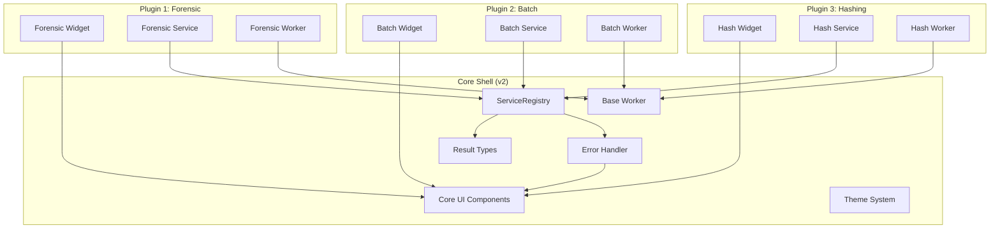

# Document 1: Core Architecture Extraction Guide

## Natural Language Technical Overview

### Understanding the Plugin Migration Strategy

The current Folder Structure Utility application is already remarkably well-positioned for plugin architecture migration. The developers have implemented sophisticated patterns that naturally support plugin-based extension:

**The Service-Oriented Foundation**: The application uses a comprehensive service registry system that acts like a "telephone directory" for all business operations. Instead of components directly talking to each other, they request services through a central registry. This means plugins can easily register their own services and consume existing ones without knowing implementation details.

**The Result-Based Communication**: Every operation returns structured Result objects instead of simple success/failure booleans. These Result objects carry rich context, error information, warnings, and metadata. This creates a standardized "language" that plugins can use to communicate success, failure, and complex operational details back to the core application.

**The Unified Threading Model**: All background operations use a consistent thread pattern with standardized signals. This means plugin developers don't need to learn different threading approaches - they can extend a single base worker pattern and automatically get cancellation, progress reporting, and error handling.

**The Tab-Centric Architecture**: Each major feature is already isolated into its own tab (ForensicTab, BatchTab, HashingTab). These tabs are essentially self-contained feature units that interact with the core through well-defined signals and service calls. This makes them natural candidates for conversion to plugins.

### What Stays in Core vs What Becomes Plugins

**The Core Shell** will retain only the essential infrastructure: the service registry that coordinates everything, the result objects that carry information between components, the error handling system that routes problems safely, and the base UI framework that provides the window and tab management.

**The Feature Plugins** will contain all the actual business logic: forensic file processing, batch queue management, hash calculation and verification, and any future features. Each plugin will be a complete, self-contained unit that can be developed, tested, and distributed independently.

**Shared Components** present an interesting challenge. Components like the files panel and form panel are used by multiple tabs but don't contain business logic themselves. The strategy is to move these into a "core UI library" so plugins can use them consistently while the core provides the foundational widgets.

### The Migration Benefits

This architecture transformation will enable **zero-downtime feature addition** - new capabilities can be added as plugins without touching the stable core code. It provides **selective deployment** where different user groups can have different plugin sets. Most importantly, it creates **development isolation** where plugin bugs cannot destabilize core operations.

---

## Senior Developer Documentation

### Core Shell Components (Must Remain in Core)

#### ServiceRegistry System (`core/services/service_registry.py`)

The ServiceRegistry is the **heart of the plugin system** and must remain in core. It provides thread-safe dependency injection that plugins will use for service discovery and registration.

```python
class ServiceRegistry:
    """Thread-safe service registry with dependency injection"""
    
    def __init__(self):
        self._services: Dict[Type, Any] = {}
        self._factories: Dict[Type, callable] = {}
        self._singletons: Dict[Type, Any] = {}
        self._lock = threading.RLock()
    
    def register_singleton(self, interface: Type[T], implementation: T):
        """Register singleton service instance"""
        with self._lock:
            self._singletons[interface] = implementation
    
    def register_factory(self, interface: Type[T], factory: callable):
        """Register service factory"""
        with self._lock:
            self._factories[interface] = factory
    
    def get_service(self, interface: Type[T]) -> T:
        """Get service instance with dependency injection"""
        with self._lock:
            if interface in self._singletons:
                return self._singletons[interface]
            if interface in self._factories:
                return self._factories[interface]()
            raise ValueError(f"Service {interface.__name__} not registered")

# Global registry and convenience functions
_service_registry = ServiceRegistry()

def get_service(interface: Type[T]) -> T:
    return _service_registry.get_service(interface)

def register_service(interface: Type[T], implementation: T):
    _service_registry.register_singleton(interface, implementation)
```

**Plugin Integration Points**:
- Plugins register their services during initialization
- Plugins access core services via `get_service(IPathService)` etc.
- Factory registration enables lazy loading of plugin services

#### Service Interfaces (`core/services/interfaces.py`)

All service interfaces MUST remain in core as they define the contracts between plugins and core services.

**Critical Interfaces for Plugin Architecture**:

```python
class IService(ABC):
    """Base interface for all services - plugins must implement this"""
    pass

class IPathService(ABC):
    """Path building and validation - used by most plugins"""
    @abstractmethod
    def build_forensic_path(self, form_data: FormData, base_path: Path) -> Result[Path]: pass
    
    @abstractmethod
    def sanitize_path_component(self, component: str) -> str: pass

class IFileOperationService(ABC):
    """File operations - core capability plugins consume"""
    @abstractmethod
    def copy_files(self, files: List[Path], destination: Path, 
                  calculate_hash: bool = True) -> FileOperationResult: pass

class IReportService(ABC):
    """Report generation - plugins can extend report types"""
    @abstractmethod
    def generate_time_offset_report(self, form_data: FormData, 
                                   output_path: Path) -> ReportGenerationResult: pass
```

**Plugin Extension Strategy**: New plugins can define additional interfaces (e.g., `IHashingService`, `IBatchService`) and register implementations.

#### Result Objects System (`core/result_types.py`)

The complete Result object hierarchy must remain in core as it provides the standardized communication protocol between plugins and core.

```python
@dataclass
class Result(Generic[T]):
    """Universal result object for plugin communication"""
    success: bool
    value: Optional[T] = None
    error: Optional[FSAError] = None
    warnings: List[str] = field(default_factory=list)
    metadata: Dict[str, Any] = field(default_factory=dict)
    
    @classmethod
    def success(cls, value: T, warnings: Optional[List[str]] = None, **metadata) -> 'Result[T]':
        return cls(success=True, value=value, warnings=warnings or [], metadata=metadata)
    
    @classmethod
    def error(cls, error: FSAError, warnings: Optional[List[str]] = None) -> 'Result[T]':
        return cls(success=False, error=error, warnings=warnings or [])
```

**Specialized Result Types** (all must remain in core):
- `FileOperationResult`: File processing results with performance metrics
- `ValidationResult`: Form validation with field-specific errors  
- `ReportGenerationResult`: Report generation with output paths and metadata
- `ArchiveOperationResult`: ZIP creation with compression details
- `HashOperationResult`: Hash calculation and verification results

#### Exception Hierarchy (`core/exceptions.py`)

The complete FSAError hierarchy must remain in core for standardized error handling across plugins.

```python
class FSAError(Exception):
    """Base exception with thread context and severity"""
    def __init__(self, message: str, user_message: Optional[str] = None, 
                 severity: ErrorSeverity = ErrorSeverity.ERROR, 
                 recovery_hint: Optional[str] = None):
        super().__init__(message)
        self.user_message = user_message or message
        self.severity = severity
        self.recovery_hint = recovery_hint
        self.thread_info = self._capture_thread_context()
```

**Key Exception Types for Plugins**:
- `FileOperationError`: File I/O failures
- `ValidationError`: Form/data validation failures  
- `ThreadError`: Background operation failures
- `ConfigurationError`: Settings and setup issues

#### Error Handler (`core/error_handler.py`)

Thread-safe error routing system that ensures plugin errors are properly displayed in the main UI thread.

```python
def handle_error(error: FSAError, context: Optional[Dict[str, Any]] = None):
    """Handle error with thread-safe UI routing"""
    # Route to main thread via signals
    # Update error statistics 
    # Preserve context information
```

#### Base Worker Thread (`core/workers/base_worker.py`)

Unified threading foundation that plugins extend for background operations.

```python
class BaseWorkerThread(QThread):
    """Base for all plugin worker threads"""
    
    # Unified signal system
    result_ready = Signal(Result)          # Single result signal
    progress_update = Signal(int, str)     # Progress with status message
    
    def __init__(self, parent=None):
        super().__init__(parent)
        self.cancelled = False
        self._cancel_requested = False
        self.pause_requested = False
```

**Plugin Benefits**:
- Consistent cancellation handling
- Standardized progress reporting
- Automatic error routing to main thread
- Built-in pause/resume support

#### Settings Manager (`core/settings_manager.py`)

Centralized settings management with plugin namespace support.

```python
class SettingsManager:
    """Thread-safe settings with plugin namespace support"""
    
    def get_plugin_setting(self, plugin_id: str, key: str, default=None):
        """Get plugin-specific setting"""
        return self._settings.value(f"plugins/{plugin_id}/{key}", default)
    
    def set_plugin_setting(self, plugin_id: str, key: str, value):
        """Set plugin-specific setting"""
        self._settings.setValue(f"plugins/{plugin_id}/{key}", value)
```

#### Error Notification System (`ui/components/error_notification_system.py`)

Non-modal error display system that plugins use for user-facing error messages.

```python
class ErrorNotificationManager:
    """Manages non-modal error notifications for plugins"""
    
    def show_error(self, error: FSAError, context: dict = None):
        """Display error notification without blocking UI"""
        # Creates auto-dismissing notification
        # Severity-based styling
        # Detailed error information on demand
```

#### Theme System (`ui/styles/carolina_blue.py`)

Centralized styling that ensures consistent appearance across plugins.

---

### Plugin Candidates (Components Moving to Plugins)

#### ForensicTab → forensic-plugin

**Current Dependencies**:
- FormPanel (shared component)
- FilesPanel (shared component) 
- LogConsole (shared component)
- TemplateSelector (shared component)
- WorkflowController (business logic)
- Various services: IPathService, IFileOperationService, IReportService

**Plugin Structure**:
```
forensic-plugin/
├── plugin.json                    # Metadata
├── __init__.py                     # Plugin entry point
├── forensic_plugin.py             # Main plugin class
├── ui/
│   └── forensic_tab_widget.py     # Tab UI (using shared components)
├── services/
│   └── forensic_service.py        # Forensic-specific business logic
└── workers/
    └── forensic_worker.py          # File processing worker
```

**Service Dependencies from Core**:
- `IPathService`: For folder structure building
- `IFileOperationService`: For file copying operations
- `IReportService`: For PDF report generation
- `IArchiveService`: For ZIP creation
- `IValidationService`: For form validation

**Plugin Services to Register**:
- `IForensicService`: Forensic workflow orchestration

#### BatchTab → batch-plugin

**Current Dependencies**:
- BatchQueueWidget (plugin-specific)
- BatchProcessorThread (plugin-specific)
- FilesPanel (shared component)
- LogConsole (shared component)

**Plugin Structure**:
```
batch-plugin/
├── plugin.json
├── batch_plugin.py
├── ui/
│   ├── batch_tab_widget.py
│   └── batch_queue_widget.py       # Move from shared
├── services/
│   └── batch_service.py
├── workers/
│   └── batch_processor.py          # Move from core/workers
└── models/
    └── batch_models.py             # Queue management
```

**Unique Dependencies**:
- BatchQueue management (moves with plugin)
- Sequential job processing logic
- Recovery system for interrupted batches

#### HashingTab → hashing-plugin

**Current Dependencies**:  
- Hash operation workers
- Hash report generation
- FilesPanel (shared)
- LogConsole (shared)

**Plugin Structure**:
```
hashing-plugin/
├── plugin.json
├── hashing_plugin.py
├── ui/
│   └── hashing_tab_widget.py
├── services/
│   ├── hash_service.py
│   └── hash_report_service.py
└── workers/
    ├── single_hash_worker.py
    └── verification_worker.py
```

---

### Shared Component Analysis

#### Core UI Library (Remains in Core)

**FormPanel** (`ui/components/form_panel.py`):
- **Status**: Move to core UI library
- **Reasoning**: Used by forensic and batch plugins, contains no business logic
- **Plugin Access**: `from core.ui.components import FormPanel`

**FilesPanel** (`ui/components/files_panel.py`):
- **Status**: Move to core UI library
- **Reasoning**: Used by all tabs, provides standardized file selection
- **Key Features**: FileEntry dataclass, drag-drop support, state management

**LogConsole** (`ui/components/log_console.py`):
- **Status**: Move to core UI library  
- **Reasoning**: Universal logging widget used by all tabs
- **Plugin Integration**: Automatic connection to plugin log signals

#### Plugin-Specific Components

**BatchQueueWidget**: Moves entirely to batch-plugin as it's only used there

**TemplateSelector**: Moves to core UI library as other plugins might use templates

---

### Migration Dependencies Map

#### Critical Path Dependencies

**Phase 1: Core Infrastructure** (Must be completed first)
1. ServiceRegistry and interfaces remain in core
2. Result object system remains in core
3. Exception hierarchy remains in core
4. Base worker thread remains in core
5. Error handling system remains in core

**Phase 2: Shared UI Components**
1. Move FormPanel, FilesPanel, LogConsole to core.ui.components
2. Create plugin interface contracts
3. Update import paths throughout codebase

**Phase 3: Plugin Framework**
1. Create plugin loading system
2. Implement plugin lifecycle management
3. Create plugin base classes and utilities

**Phase 4: Plugin Migration** (Can be done independently)
1. ForensicTab → forensic-plugin (lowest risk, most isolated)
2. HashingTab → hashing-plugin (medium complexity)
3. BatchTab → batch-plugin (highest complexity due to queue management)

#### Import Dependency Analysis

**Core Dependencies** (Everything depends on these):
```python
from core.services import get_service, register_service
from core.result_types import Result, FileOperationResult
from core.exceptions import FSAError, ErrorSeverity  
from core.workers.base_worker import BaseWorkerThread
```

**Shared UI Dependencies**:
```python
from core.ui.components import FormPanel, FilesPanel, LogConsole
from core.ui.styles import CarolinaBlueTheme
```

**Plugin Interface Dependencies**:
```python
from core.services.interfaces import IPathService, IFileOperationService
from core.plugin_system import IPlugin, PluginMetadata
```

---

### Core Shell Architecture Diagram



### Migration Risk Assessment

**Low Risk Components** (Easy to migrate):
- ForensicTab: Self-contained, well-defined interfaces
- Theme system: No dependencies, pure styling
- Shared UI components: No business logic

**Medium Risk Components** (Moderate complexity):
- Service implementations: Need interface preservation
- Worker threads: Thread safety considerations
- HashingTab: Complex worker coordination

**High Risk Components** (Require careful planning):
- BatchTab: Complex state management and recovery
- Settings system: Plugin namespace integration required
- Error handling: Cross-thread communication patterns

### Plugin Development Guidelines

#### Plugin Interface Contract

```python
class IPlugin(ABC):
    """Base interface all plugins must implement"""
    
    @property
    @abstractmethod
    def metadata(self) -> PluginMetadata:
        """Plugin identification and dependency information"""
        pass
    
    @abstractmethod
    def initialize(self, services: ServiceRegistry, settings: SettingsManager) -> Result[None]:
        """Initialize plugin with core services"""
        pass
    
    @abstractmethod
    def create_widget(self) -> Optional[QWidget]:
        """Create the main plugin widget (tab content)"""
        pass
    
    @abstractmethod
    def cleanup(self) -> Result[None]:
        """Clean up resources before plugin unload"""
        pass
```

#### Plugin Metadata Structure

```python
@dataclass
class PluginMetadata:
    """Plugin identification and requirements"""
    id: str                                    # Unique identifier
    name: str                                  # Display name
    version: str                               # Plugin version
    core_version_required: str                 # Minimum core version
    author: str                                # Developer information
    description: str                           # User-facing description
    category: str                              # Plugin category
    dependencies: Dict[str, str]               # Required services/plugins
    permissions: List[str]                     # Required permissions
    entry_point: str                           # Main plugin class
```

This architecture extraction provides the complete foundation needed to transform the monolithic Folder Structure Utility into a plugin-based platform while preserving all existing functionality and enabling future extensibility.

<function_calls>
<invoke name="TodoWrite">
<parameter name="todos">[{"content": "Analyze core service registry and interfaces for plugin architecture", "status": "completed", "activeForm": "Analyzing core service registry and interfaces for plugin architecture"}, {"content": "Document current tab structures and their plugin conversion requirements", "status": "completed", "activeForm": "Documenting current tab structures and their plugin conversion requirements"}, {"content": "Map shared UI components and their distribution strategy", "status": "completed", "activeForm": "Mapping shared UI components and their distribution strategy"}, {"content": "Create comprehensive Document 1 with natural language and technical sections", "status": "completed", "activeForm": "Creating comprehensive Document 1 with natural language and technical sections"}]